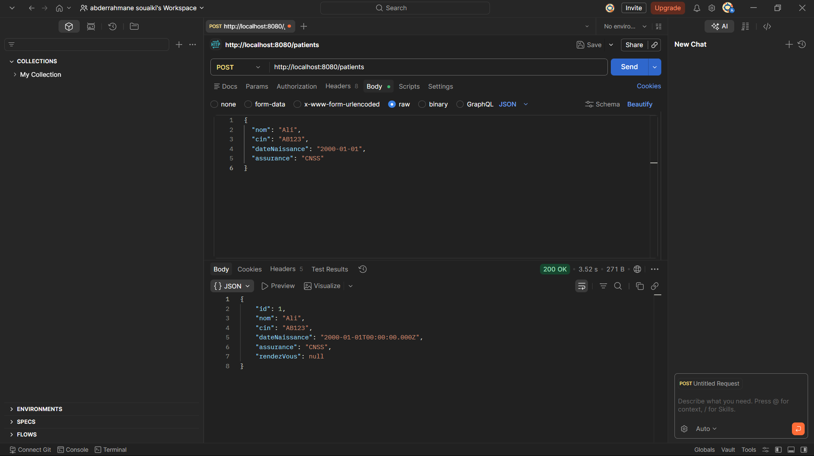
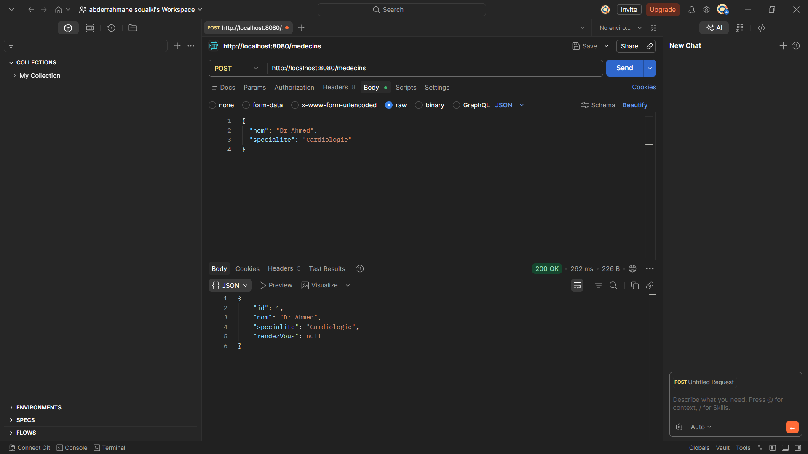
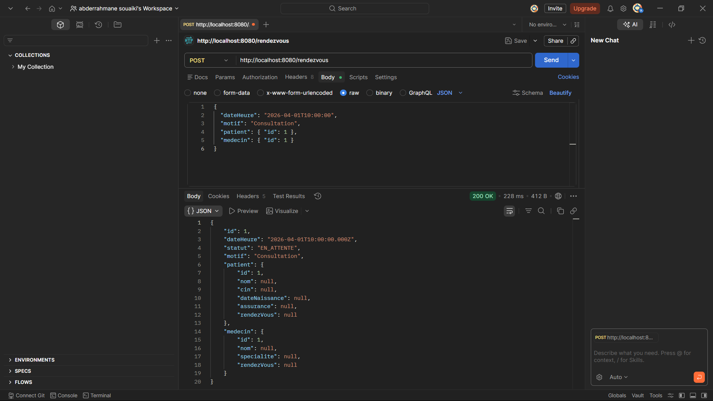
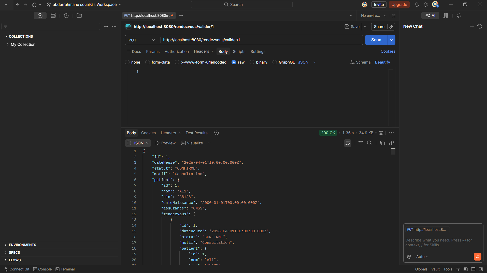
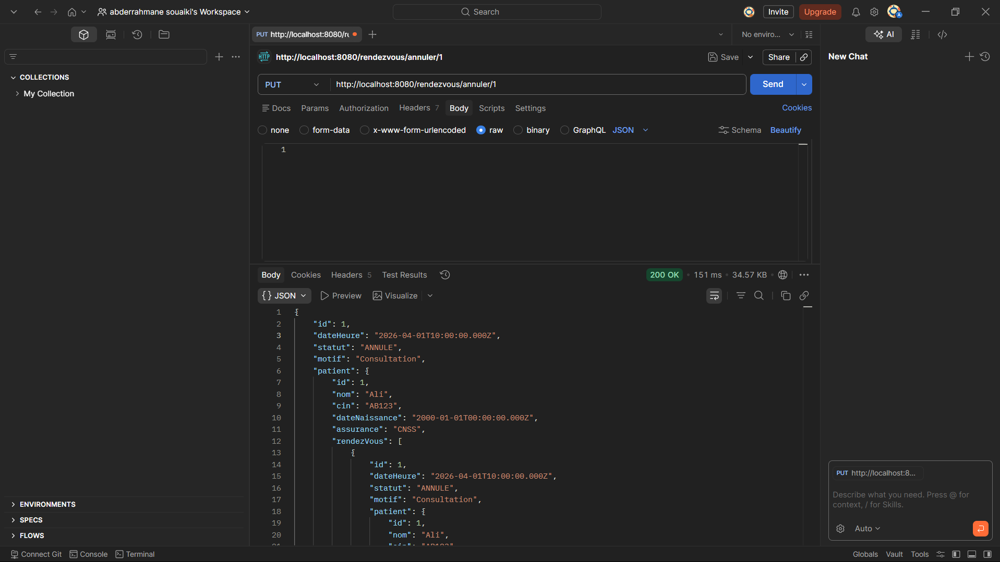

# 🏥 Gestion des Rendez-vous Médicaux

## 📌 Description

Ce projet est une application backend développée avec **Spring Boot** permettant de gérer une clinique médicale.
Elle permet de gérer les patients, les médecins ainsi que les rendez-vous.

---

## ⚙️ Technologies utilisées

* Java 17+
* Spring Boot
* Spring Data JPA (Hibernate)
* MySQL (XAMPP / phpMyAdmin)
* Lombok
* Postman (tests API)

---

## 🧩 Architecture du projet

L'application suit une architecture en couches :

* **Controller** → API REST
* **Service** → logique métier
* **Repository** → accès base de données
* **Entity** → mapping JPA

---

## 🗄️ Configuration de la base de données

Créer une base de données nommée :

```
clinique_db
```

Configurer le fichier `application.properties` :

```properties
spring.datasource.url=jdbc:mysql://localhost:3306/clinique_db?useSSL=false&serverTimezone=UTC
spring.datasource.username=root
spring.datasource.password=

spring.jpa.hibernate.ddl-auto=update
spring.jpa.show-sql=true
```

---

## 🚀 Lancement du projet

1. Ouvrir le projet avec IntelliJ
2. Lancer XAMPP (MySQL)
3. Exécuter la classe principale
4. Vérifier :

```
Tomcat started on port 8080
```

---

## 🌐 API Endpoints

### 🧍 Patients

* POST `/patients` → Ajouter un patient
* GET `/patients` → Liste des patients

### 👨‍⚕️ Médecins

* POST `/medecins` → Ajouter un médecin
* GET `/medecins` → Liste des médecins
* GET `/medecins/specialite/{sp}` → Filtrer par spécialité

### 📅 Rendez-vous

* POST `/rendezvous` → Créer un rendez-vous
* GET `/rendezvous` → Liste des rendez-vous

### 🔁 Actions

* PUT `/rendezvous/valider/{id}`
* PUT `/rendezvous/annuler/{id}`
* PUT `/rendezvous/absent/{id}`

### 📊 Statistiques

* GET `/rendezvous/stats/specialite`
* GET `/rendezvous/stats/mois`
* GET `/rendezvous/stats/noshow`

---

## 🧪 Tests API (Postman)

### ➤ Ajouter un patient

```json
{
  "nom": "Ali",
  "cin": "AB123",
  "dateNaissance": "2000-01-01",
  "assurance": "CNSS"
}
```

### ➤ Ajouter un médecin

```json
{
  "nom": "Dr Ahmed",
  "specialite": "Cardiologie"
}
```

### ➤ Créer un rendez-vous

```json
{
  "dateHeure": "2026-04-01T10:00:00",
  "motif": "Consultation",
  "patient": { "id": 1 },
  "medecin": { "id": 1 }
}
```





---

## ⚠️ Remarques importantes

* Le format de date doit être : `yyyy-MM-ddTHH:mm:ss`
* Les IDs doivent exister avant de créer un rendez-vous
* Les tables sont générées automatiquement par Hibernate

---

## 🎯 Fonctionnalités principales

* Gestion des patients
* Gestion des médecins
* Gestion des rendez-vous
* Validation / annulation / absence
* Statistiques (spécialité, mois, no-show)

---

## 👨‍💻 Auteur
abderrahmane souaiki
Projet réalisé dans le cadre d’un TP Spring Boot.
